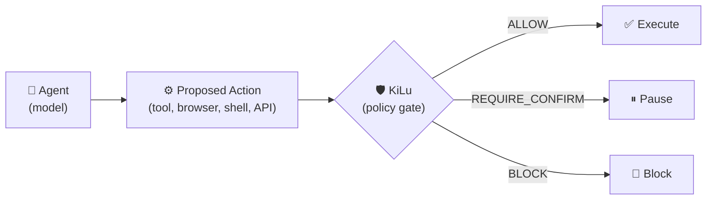

# KiLu SDK

[](https://github.com/IkaRiche/kilu-sdk/actions/workflows/test.yml)

**Agents decide. KiLu authorizes.**

KiLu is an execution authority layer for AI systems. It places an explicit decision boundary before tool calls, browser actions, and other high-risk execution paths.

> **Status:** Published SDK · Runnable examples · Real control plane path · Durable decision records



---

## 🚀 Quickstart

Start with one execution surface: one tool, one browser action, or one approval path.

```bash
npm install @kilu-control/sdk
```

```typescript
import { KiluClient, IntentPayload } from '@kilu-control/sdk';

const kilu = new KiluClient({
  baseUrl: process.env.KILU_BASE_URL!,
  apiKey: process.env.KILU_API_KEY!,
});

async function executeAgentTool(toolName: string, args: Record<string, any>) {
  const intent: IntentPayload = {
    actor: 'agent-01',
    action: toolName,
    target: JSON.stringify(args),
  };

  const auth = await kilu.submitIntent(intent);

  if (auth.outcome === 'BLOCK') {
    throw new Error(`Execution blocked: ${auth.reason}`);
  }

  if (auth.outcome === 'REQUIRE_CONFIRM') {
    return triggerHumanApprovalFlow(intent, auth.pending_approval_id);
  }

  // ALLOW -> execute with cryptographic receipt
  return doActualExecution(toolName, args);
}
```

---

## ⚡ Live Integration Proofs

### 🛠️ MCP Tool Gate
Wrap MCP tool handlers so destructive actions pause for human approval before execution.
<br>
→ [`examples/mcp-tool-gate`](./examples/mcp-tool-gate/)

### 🤖 LangGraph Approval Gate
Drive LangGraph's `interrupt()` flow with a deterministic policy gate instead of fragile prompt checks.
<br>
→ [`examples/langgraph-approval-gate`](./examples/langgraph-approval-gate/)

### 🌐 Browser Action Control
Intercept Playwright/Puppeteer actions with a `beforeAction()` hook to prevent autonomous hallucinations.
<br>
→ [`examples/browser-approval`](./examples/browser-approval/)

All examples run locally with a mock authority layer and can be pointed at a real KiLu control plane.

---

## Developer References

* [API Reference](./docs/api-reference.md)
* [Receipts & Verification](./docs/receipts-and-verification.md)
* [Examples](./examples/README.md)

---

## How KiLu Compares

| Approach | What it does | What it misses |
|---|---|---|
| Prompt guardrails | Hints the model via system prompt | Fragile, bypassable, no enforcement |
| Logs / audit trails | Records what happened | Too late — damage already done |
| HITL on every action | Adds manual review | Approval fatigue, no policy semantics |
| `securitySchemes` / OAuth | Controls access to APIs | No per-action policy, no decision audit |
| Custom decorators / wrappers | Adds local checks around sensitive tools | Fragmented policy, duplicated logic, weak consistency, poor auditability |
| **KiLu** | **Decides before execution** | **Authority layer with receipts** |

---

## Typical Outcomes

| Outcome | When | Example |
|---|---|---|
| **`ALLOW`** | Low-risk action within policy | `file.read`, `browser.hover`, `mcp.read` |
| **`REQUIRE_CONFIRM`** | Valid action, needs human approval | `email.send`, `shell.exec`, `payment.charge` |
| **`BLOCK`** | Violates current policy | `system.rm`, `database.drop`, `shell.exec.dangerous` |

---

## Use Cases

**Use KiLu when your agent currently...**

- 🔧 Calls MCP tools directly without context checks
- 🌐 Clicks or browses without human approval
- 💻 Executes shell commands without a policy gate
- 🔄 Performs API mutations without confirmation
- 📜 Lacks verifiable authorization records

---

## What KiLu Is Not

KiLu is **not**:
- an agent framework
- a planner
- a browser automation library
- a general-purpose policy platform

KiLu is strictly the **authority layer** for autonomous execution.
Your model proposes actions. KiLu decides whether they run.

---

## Trust & Verification

- ✅ 3 runnable integration proofs (MCP, LangGraph, Browser)
- ✅ Mock authority for local development
- ✅ Real production control plane path (`POST /v1/intent`)
- ✅ Ed25519-signed execution receipts
- ✅ Durable decision log (D1-backed audit trail)
- ✅ Deterministic policy evaluation (no LLM in the decision path)

Read more: [API Reference](./docs/api-reference.md) · [Receipts & Verification](./docs/receipts-and-verification.md) · [Examples](./examples/README.md)

---

## FAQ

<details>
<summary><strong>Is KiLu another agent framework?</strong></summary>

No. It sits *between* your agent and execution as a policy gate. KiLu does not replace LangGraph, CrewAI, or AutoGen.
</details>

<details>
<summary><strong>Does it replace MCP or LangGraph?</strong></summary>

No. It wraps MCP tool handlers and drives LangGraph's `interrupt()` flow.
</details>

<details>
<summary><strong>Do examples require a live backend?</strong></summary>

No. Every example ships with a local mock authority layer that you can easily swap for a real control plane.
</details>

<details>
<summary><strong>What does REQUIRE_CONFIRM mean?</strong></summary>

The action is valid but needs explicit human approval before execution. Forward the `pending_approval_id` to a reviewer.
</details>

<details>
<summary><strong>Can I run it against a real control plane?</strong></summary>

Yes. Decisions are durably recorded via Cloudflare Workers and signed with Ed25519 receipts.
</details>

---

Status: early, usable, and actively evolving. Real control plane path available.

## License

MIT © [KiLu Network](https://kilu.network)
